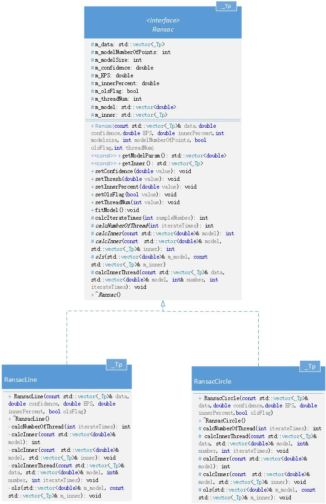
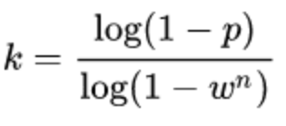

### This document describes the features of the Ransac class and the precautions for using it.
## 1. 功能简介
RANSAC全程Random sample consensus，中文即“随机抽样一致算法”，该方法采用迭代的方式从一组包含离群（outlier或者错误数据）的被观测数据中估算出数学模型的参数，相比最小二乘方法，它融合了剔除不合格数据的思想，因此对于有部分错误数据的数据样本，能够更快更准的给出辨识结果。OpenCV未显式提供Ransac算法，但在进行特征点匹配筛选时使用了该功能。

## 2. 类的介绍
Ransac<_Tp>模板类由一个抽象的基类开始，将公有的流程和成员变量及成员函数封装在基类,对于特定实现的功能提供纯虚函数接口。RansacLine<_Tp>与RansacCircle<_Tp>共有继承与Ransac<_Tp>类型，子类必须实现其纯虚函数。

## 3. 成员函数介绍（仅说明Public函数）

* Ransac<_Tp>::Ransac(const std::vector<_Tp>& data, double confidence, double EPS, double innerPercent,int modelSize, int modelNumberOfPoints, bool olsFlag = false,int threadNum = -1) :   	
	> * data为输入数据类型。
    > * confidence为能抽中好的模型的概率。
    > * EPS为计算内点时的误差阈值。
    > * innerPercent为预估内点占比。
    > * modelSize为模型的参数个数。
    > * modelNumberOfPoints为每次抽样时需要样本点的个数。
    > * olsFlag为是否使用最小二乘法的标识。
    > * threadNum为采用线程个数，默认值为-1，表示由数据量与计算量自动确定。

* void setConfidence(double value)  设定置信度。
* void  setEPS(double value)    设定误差阈值。
* void setInnerPercent(double value)    设定内点占比。
* void setOlsFlag(bool value)  设定使用最小二乘法的标识。
* void setThreadNum(int value) 设定线程数量。
* void fitModel() 开始拟合模型

* RansacLine<_Tp>::RansacLine(const std::vector<_Tp>& data, double confidence, double EPS, double innerPercent, bool olsFlag = false) :Ransac<_Tp>( data, confidence,  EPS,  innerPercent,3,2,olsFlag ) 
    > * 调用Ransac类的构造函数，令modelSize =3，modelNumberOfPoints=2。

* RansacCircle(const std::vector<_Tp>& data,double confidence,double EPS, double innerPercent,bool olsFlag)
:Ransac<_Tp>(data, confidence, EPS, innerPercent,3, 3,olsFlag)
    > * 调用Ransac类的构造函数，令modelSize =3，modelNumberOfPoints=3。
## 4. 调用示例
### 4.1 RansacLine
    RansacLine<Point2f> ransac(data, 0.999, 1, 0.3, true);
    ransac.fitModel();

### 4.2 RansacCircle
    RansacCircle<Point2f> ransac(data, 0.999,4, 0.5, true);
    ransac.fitModel();

## 5. 注意事项
### 5.1 迭代次数
迭代次数计算公式为：

其中，p pp表示为RANSAC算法结果有用的概率，w ww为数据在inliers集中的概率，那么对于模型拟合一次需要的n个数据

### 5.2 线程数的计算
使用自动确定线程数时，需要根据实际运行机器的逻辑处理器的数量进行试验测试，将测试结果绘制成heatmap。
本机cpu核心数为6，采用超线程技术使每个核心可以模拟两个逻辑处理器。测试图如下：

* RansacLine

* RansacCiecle

根据heatmap进行代码修改：

    int RansacCircle<_Tp>::calcNumberOfThread(int iterateTimes) {
	//1.根据数据量与本机CPU支持的核心数确定线程数量;
	SYSTEM_INFO sysInfo;
	GetSystemInfo(&sysInfo);
	//目前电脑6核，超线程技术模拟成12个逻辑处理器。
	int threadNum = 0;
	unsigned int  dataSize = this->m_data.size();
	if ( dataSize  < 113) {
		threadNum = 1;
	}
	else if ( dataSize < 306) {
		threadNum = sysInfo.dwNumberOfProcessors / 6;
	}
	else if (dataSize < 831) {
		threadNum = sysInfo.dwNumberOfProcessors / 3;
	}
	else if (dataSize < 2262) {
		threadNum = sysInfo.dwNumberOfProcessors / 2;
	}
	else {
		threadNum = sysInfo.dwNumberOfProcessors;
	}
	return threadNum;
    }

## 6. 实现新的模型拟合功能
在Ransac基类上实现新的模型拟合功能，继承基类之后必须实现以下几个虚函数：

    //计算线程数量
	virtual  int calcNumberOfThread(int iterateTimes) = 0;

	//计算内点数量不保留内点
	virtual int calcInner(const std::vector<double>& model) = 0;

	//计算内点数量只保留内点
	virtual void calcInner(const  std::vector<double>& model, std::vector<_Tp>& inner) = 0;

	//最小二乘法拟合
	virtual void ols(std::vector<double>& m_model, const std::vector<_Tp>& m_inner) = 0;
	
	//线程回调函数
	virtual void calcInnerThread(const std::vector<_Tp>& data, std::vector<double>& model, int& number, int iterateTimes) = 0;
	